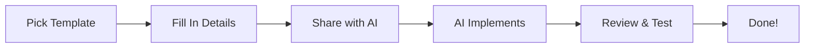

# 🚀 Confer Agent Kit

> **AI-first templates for planning, building, fixing, and shipping — fast, consistent, and project-agnostic.**

**Confer Agent Kit** is a collection of **29 structured templates** that help you and AI agents work together to build software faster and more consistently. Think of it as a blueprint library for your entire development workflow.

---

## 📋 Table of Contents

- [What Is This?](#what-is-this)
- [Why Use It?](#why-use-it)
- [Quick Start (5 Minutes)](#quick-start-5-minutes)
- [How Templates Work](#how-templates-work)
- [Template Categories](#template-categories)
- [Common Workflows](#common-workflows)
- [Project Profile System](#project-profile-system)
- [Auto-Numbering Tasks](#auto-numbering-tasks)
- [Task Orchestrator](#task-orchestrator)
- [Best Practices](#best-practices)
- [Examples](#examples)
- [Contributing](#contributing)
- [Resources](#resources)

---

## 🤔 What Is This?

Confer Agent Kit provides **structured templates** (like fill-in-the-blank forms) that guide you through:

- ✅ **Planning** your project from idea to launch
- ✅ **Building** features with AI assistance
- ✅ **Fixing** bugs systematically
- ✅ **Deploying** to infrastructure platforms

### Think of it like this:

```
Traditional Approach:
You → AI Chat → "Build me a login page" → AI guesses what you want → Inconsistent results

With Confer Agent Kit:
You → Template → Fill in structured questions → AI knows exactly what to build → Consistent, predictable results
```

### What it IS:

- ✅ **A template library** — 29 ready-to-use templates
- ✅ **Project-agnostic** — Works with any tech stack
- ✅ **AI-friendly** — Structured for AI agents to understand
- ✅ **Consistent** — Same format every time = predictable results

### What it is NOT:

- ❌ A framework or runtime dependency
- ❌ Tied to specific technologies
- ❌ A replacement for documentation
- ❌ Code that runs in your app

---

## 💡 Why Use It?

### For Junior Developers:

1. **Learn Best Practices** — Templates guide you through industry-standard workflows
2. **Reduce Decision Fatigue** — Templates tell you what to think about
3. **Avoid Missing Steps** — Checklists ensure nothing falls through the cracks
4. **Get Better AI Results** — Structured input = better AI output

### For Senior Developers:

1. **Standardize Team Workflows** — Everyone follows the same process
2. **Accelerate Development** — Spend less time structuring, more time building
3. **Improve AI Collaboration** — Templates give AI the context it needs
4. **Maintain Consistency** — Same structure across all projects

### For Teams:

1. **Onboarding** — New team members can learn from templates
2. **Consistency** — All tasks follow the same format
3. **Knowledge Sharing** — Templates capture institutional knowledge
4. **Quality** — Built-in checklists and validation

---

## ⚡ Quick Start (5 Minutes)

### Step 1: Copy the Profile Template

Your project needs a configuration file. Copy the example and fill it in:

```bash
cp confer-agent.profile.example.yml confer-agent.profile.yml
```

Then edit `confer-agent.profile.yml` with your project details:

```yaml
env: dev
http_port: 3000
frameworks: ["next@14", "fastapi@0.115"]
db: "postgres+drizzle"
auth: "clerk"
infra: "coolify|vercel"
```

### Step 2: Pick Your First Template

Browse `TEMPLATE_INDEX.md` to find what you need:

- **Building a feature?** → Use `task_template_full.md` or `task_template_quick.md`
- **Fixing a bug?** → Use `bugfix.md`
- **Planning a project?** → Start with `01_master_idea.md`

### Step 3: Copy and Fill In

1. Open the template file
2. Copy it to `tasks/001_my_task.md` (or use auto-numbering)
3. Fill in the sections
4. Work through it with your AI agent

### Step 4: Use It!

Give your filled-in template to an AI agent. It will understand:
- What you're building
- Your tech stack (from the profile)
- Constraints and requirements
- Success criteria

**Example:**

```
You: "Hey AI, help me complete this task: tasks/001_add_user_auth.md"
AI: *Reads template* "I see you want to add Clerk authentication. 
    Based on your profile, I'll create the Next.js server actions in 
    src/lib/actions/ and the auth component in src/components/auth/..."
```

**📖 See [`templates/02-dev/commands_reference.md`](templates/02-dev/commands_reference.md) for more examples of how to invoke templates with different AI tools.**

That's it! 🎉

---

## 🔧 Using in Existing Repositories

If you're working on an **existing project**, here's how to add Confer Agent Kit without disrupting your codebase.

### Recommended Approach: Vendor the Kit

**Keep it simple!** Copy the kit into your project root as a subfolder. This keeps each repo independent and easy to manage.

### Project Structure

After adding the kit, your repo will look like this:

```
<your-app-repo>/
├── confer-agent-kit/      ← The kit lives here
│   ├── templates/
│   ├── README.md
│   └── ...
├── confer-agent.profile.yml  ← Your project profile (at repo root)
├── src/                    ← Your application code
├── package.json
└── ...
```

**Important:** 
- Put the kit at the **project root** (not under `src/`)
- The kit is **tooling**, not runtime code
- Keep the kit's internal structure unchanged
- Put your project profile at the **repo root** (`confer-agent.profile.yml`)

### Two Ways to Vendor the Kit

#### Option 1: Simple Copy (Easiest for Juniors)

**Best for:** Getting started quickly, one-time setup

1. **Download or clone** the kit:
   ```bash
   git clone https://github.com/confersolutions/confer-agent-kit.git /tmp/confer-agent-kit
   ```

2. **Copy to your project root:**
   ```bash
   cd /path/to/your-app-repo
   cp -r /tmp/confer-agent-kit ./confer-agent-kit
   ```

   Or use a zip file:
   - Download the kit as a zip
   - Extract it to `confer-agent-kit/` in your project root

3. **Done!** The kit is now in your repo.

**Pros:** Simple, no git complexity  
**Cons:** Manual updates needed if the kit changes

#### Option 2: Git Subtree (Easy Updates Later)

**Best for:** Easy updates when the kit improves

From your existing project repo root:

```bash
# Add the kit as a subtree (one-time)
git subtree add --prefix confer-agent-kit \
  https://github.com/confersolutions/confer-agent-kit.git main --squash

# Later, update the kit (when needed)
git subtree pull --prefix confer-agent-kit \
  https://github.com/confersolutions/confer-agent-kit.git main --squash
```

**Pros:** Easy updates later  
**Cons:** Slightly more complex initial setup

**Note:** We recommend avoiding git submodules for juniors (they're confusing). Subtree or simple copy work great!

### Bootstrap Checklist for Juniors

Follow these simple steps to get started:

- [ ] **Step 1:** Drop `confer-agent-kit/` at your project root
- [ ] **Step 2:** Copy `confer-agent-kit/confer-agent.profile.example.yml` → `./confer-agent.profile.yml`
- [ ] **Step 3:** Fill in `confer-agent.profile.yml` with your project details
- [ ] **Step 4:** Keep secrets in your platform's environment variables (not in git)
- [ ] **Step 5:** Use `templates/02-dev/task_template_quick.md` for quick tasks
- [ ] **Step 6:** Use `templates/02-dev/task_template_full.md` for bigger features
- [ ] **Step 7:** Use `templates/05-advanced/task_orchestrator.md` for chaining multiple tasks

**That's it!** You don't need to change the kit's structure. Just ensure:
- ✅ The kit folder is at the repo root
- ✅ The profile file is at the repo root
- ✅ Everything else stays as-is

### Quick Example

```bash
# In your existing project
cd ~/projects/my-existing-app

# Add the kit (simple copy)
cp -r ~/confer-agent-kit ./confer-agent-kit

# Create your profile
cp confer-agent-kit/confer-agent.profile.example.yml ./confer-agent.profile.yml

# Edit the profile
# ... fill in your project details ...

# Start using templates!
cd confer-agent-kit/templates/02-dev
# Copy task_template_quick.md to your tasks/ folder
```

---

## 📚 How Templates Work

Every template follows the same structure (this is what makes AI agents so effective):

### Template Structure

```
┌─────────────────────────────────────┐
│  YAML Front Matter                  │  ← Metadata (status, priority, etc.)
├─────────────────────────────────────┤
│  1. Context Capsule                 │  ← Your project setup
├─────────────────────────────────────┤
│  2. Problem & Goal                  │  ← What you're building/why
├─────────────────────────────────────┤
│  3. Requirements                    │  ← Functional & technical needs
├─────────────────────────────────────┤
│  4. Implementation Plan             │  ← Step-by-step approach
├─────────────────────────────────────┤
│  5. File Map & Artifacts            │  ← Files to create/modify
├─────────────────────────────────────┤
│  6. Testing Checklist               │  ← How to verify success
├─────────────────────────────────────┤
│  7. AI Agent Actions                │  ← Instructions for AI
└─────────────────────────────────────┘
```

### Why This Works

1. **Structured Input** → AI knows exactly what information to look for
2. **Consistent Format** → AI learns patterns across all your tasks
3. **Clear Context** → AI understands your project setup
4. **Explicit Requirements** → AI knows what success looks like

---

## 📁 Template Categories

We organize templates into **6 categories** for easy navigation:

### 🎯 01-Prep: Project Planning (9 templates)

Plan your entire project from idea to launch:

- `01_master_idea.md` - Define your vision, metrics, and roadmap
- `02_app_name.md` - Naming and positioning strategy
- `03_ui_theme.md` - Design system and theming
- `04_logo_prompts.md` - Logo generation prompts
- `05_pages_and_functionality.md` - Feature mapping and sitemap
- `06_wireframes.md` - Wireframe planning
- `07_data_models.md` - Database schema design
- `08_system_design.md` - Architecture overview
- `09_build_order.md` - Phased build plan

**Use these when:** Starting a new project or major feature

### 💻 02-Dev: Daily Development (8 templates)

Build features and fix bugs:

- `task_template_full.md` - Comprehensive feature template (18 sections)
- `task_template_quick.md` - Fast task template (<2 hours)
- `bugfix.md` - Bug reproduction → fix → validation workflow
- `diff_review.md` - Code review checklist
- `git_commit_messages.md` - Commit message guidelines
- `pr_review_checklist.md` - PR review checklist
- `cleanup_ts_js.md` - Code cleanup workflow
- `update_workflow.md` - Dependency update process

**Use these when:** Building features or fixing bugs

### 🎨 03-UI: User Interface (3 templates)

Design and improve UI:

- `landing_page.md` - Landing page design
- `improve_ui.md` - UI improvement workflow
- `diagram_mermaid.md` - Mermaid diagram generation

**Use these when:** Working on UI/UX

### 🗄️ 04-DB: Database Operations (2 templates)

Database migrations and rollbacks:

- `drizzle_down_migration.md` - Create down migrations
- `drizzle_rollback.md` - Rollback migrations

**Use these when:** Making database changes

### 🏗️ 05-Advanced: Advanced Workflows (7 templates)

Orchestration and specialized workflows:

- `task_orchestrator.md` - Run multiple tasks with dependencies
- `agent_orchestrator.md` - Multi-agent orchestration
- `python_task_template.md` - Python-specific tasks
- `adk_task_template.md` - AutoGen agent tasks
- Plus more specialized templates...

**Use these when:** Managing complex multi-task workflows

### 🌐 06-Infra: Infrastructure (10 templates)

Deployment and infrastructure runbooks:

- `00_infra_conventions.md` - Infrastructure standards
- `coolify_platform.md` - Coolify deployment runbook
- `vercel_frontend.md` - Vercel frontend deployment
- `replit_dev_env.md` - Replit development setup
- `n8n_ops.md` - n8n workflow automation
- `flowise_ops.md` - Flowise LLM workflows
- `qdrant_ops.md` - Qdrant vector database
- `neo4j_ops.md` - Neo4j graph database
- Plus OAuth setup, GCP debugging...

**Use these when:** Deploying or managing infrastructure

**📖 See `TEMPLATE_INDEX.md` for the complete list with descriptions**

---

## 🎬 Common Workflows

### Workflow 1: Building a New Feature



**Step-by-step:**

1. **Choose your template:**
   - Simple feature (<2 hours)? → `task_template_quick.md`
   - Complex feature? → `task_template_full.md`

2. **Fill in the template:**
   - Copy template to `tasks/001_feature_name.md`
   - Fill in Context Capsule (from your profile)
   - Define Problem & Goal
   - List Requirements
   - Plan implementation steps

3. **Share with AI:**
   ```
   "Help me implement this task: tasks/001_feature_name.md"
   ```

4. **AI understands:**
   - Your tech stack (from profile)
   - What you're building (from template)
   - How to structure code (from data access patterns)
   - Success criteria (from checklist)

5. **Review & test:**
   - Check off success criteria
   - Update status to `done`
   - Commit with a clear message

### Workflow 2: Fixing a Bug

1. Use `bugfix.md` template
2. Document reproduction steps
3. Identify root cause
4. Plan fix
5. Implement & validate
6. Add regression test

**Example:**

```markdown
## 4. Reproduction

1. Go to /login
2. Enter invalid email
3. Click submit
4. **Expected:** Error message
5. **Actual:** Page crashes

## 5. Root Cause

- Input validation missing in form handler
- Server action doesn't catch validation errors
```

### Workflow 3: Planning a New Project

Follow the prep templates in order:

1. `01_master_idea.md` - Define vision
2. `02_app_name.md` - Choose name
3. `03_ui_theme.md` - Design system
4. `05_pages_and_functionality.md` - Features & pages
5. `07_data_models.md` - Database design
6. `08_system_design.md` - Architecture
7. `09_build_order.md` - Build plan

**Result:** Complete project plan before writing any code!

### Workflow 4: Orchestrating Multiple Tasks

Use `task_orchestrator.md` to manage related tasks:

```yaml
mode: "sequential"  # or "parallel"

tasks:
  - id: "T1"
    title: "Set up database schema"
    template: "templates/02-dev/task_template_full.md"
    slug: "setup_db_schema"
    depends_on: []  # No dependencies
    
  - id: "T2"
    title: "Create API endpoints"
    template: "templates/02-dev/task_template_quick.md"
    slug: "create_api_endpoints"
    depends_on: ["T1"]  # Runs after T1
```

The orchestrator will:
- Auto-number child tasks
- Run them in dependency order
- Track progress
- Report completion

---

## 📋 Recommended Flow (Optional)

**Note:** This is a suggested workflow. Use templates as needed; there's no enforced structure. These guidelines are optional and adaptable to your needs.

### When to Use Which Templates

**Planning Phase (01-prep):**
- Start with `01_master_idea.md` to define vision and goals
- Use `02_app_name.md`, `03_ui_theme.md` for branding
- Follow `05_pages_and_functionality.md` → `07_data_models.md` → `08_system_design.md` → `09_build_order.md` as needed
- Complete before writing code

**Development Phase (02-dev):**
- **Quick tasks** (<2 hours): Use `task_template_quick.md`
- **Complex features**: Use `task_template_full.md`
- **Bugs**: Use `bugfix.md`
- **Testing**: Use `testing_checklist.md` after implementation
- **Verification**: Use `verification_workflow.md` after merge/deploy

**UI Work (03-ui):**
- Use `improve_ui.md`, `landing_page.md`, or `diagram_mermaid.md` as needed

**Database Work (04-db):**
- Use `drizzle_down_migration.md` or `drizzle_rollback.md` for migrations

**Infrastructure (06-infra):**
- Use platform-specific runbooks (`coolify_platform.md`, `vercel_frontend.md`, etc.)
- Reference `00_infra_conventions.md` for port/routing conventions

**Advanced (05-advanced):**
- Use `task_orchestrator.md` for multi-task workflows with dependencies
- Supports optional multi-agent hints (backward compatible)

### Where Standards Are Consulted

**Optional guidance files** in `standards/`:
- `standards/global.md` - Naming, logging, errors, docs, tokens
- `standards/backend.md` - API patterns, DTOs, validation, error mapping
- `standards/frontend.md` - Component structure, state management, accessibility

**Usage:** Reference standards files when filling templates or implementing features. They're checklists and examples, not mandates.

**Example:** When implementing an API endpoint, check `standards/backend.md` for DTO patterns, validation, and error handling guidance.

---

## ⚙️ Project Profile System

**The secret sauce:** All templates reference a single configuration file that keeps your project details in one place.

### Why This Matters

Instead of hard-coding ports, frameworks, etc. in every template, you define them once in `confer-agent.profile.yml`.

### Profile Structure

```yaml
env: dev                          # dev | staging | prod
http_port: 3000                   # Your API port
frameworks: ["next@14", "fastapi@0.115"]  # Tech stack
db: "postgres+drizzle"            # Database
auth: "clerk"                     # Auth system
infra: "coolify|vercel"           # Infrastructure
```

### How Templates Use It

Templates reference values like `{{ENV}}`, `{{HTTP_PORT}}`, etc. When you fill in a template, you copy values from the profile:

```markdown
## Context Capsule

- **Runtime profile:** dev (from profile)
- **Default ports:** HTTP=3000 (from profile)
- **Frameworks:** Next.js 14, FastAPI 0.115 (from profile)
```

**Benefit:** Change your profile once, and all future templates automatically use the updated values.

### Two Profile Files

1. **`confer-agent.profile.yml`** (committed)
   - Project-wide configuration
   - Shared with team
   - Used by all templates

2. **`confer-agent.profile.local.yml`** (gitignored)
   - Your personal overrides
   - Dev-only ports, local URLs
   - Never committed

---

## 🔢 Auto-Numbering Tasks

Tasks are automatically numbered to prevent conflicts:

### How It Works

1. Scan `tasks/` directory for existing numbered files
2. Find highest number (e.g., `005_refactor_api.md`)
3. Create next task as `006_new_feature.md`

### Example

```bash
tasks/
├── 001_setup_auth.md      # First task
├── 002_add_login.md       # Second task
├── 005_refactor_api.md    # Fifth task (003, 004 skipped)
└── 006_new_feature.md     # Next task (auto-numbered)
```

### Why This Matters

- ✅ No filename conflicts
- ✅ Chronological ordering
- ✅ Easy to reference ("see task 006")
- ✅ Works with git history

### Manual Override

If you need a specific number, you can create it manually, but auto-numbering handles most cases.

---

## 🎯 Task Orchestrator

**Advanced feature:** Run multiple related tasks with automatic dependency management.

### When to Use

- Building a feature that requires multiple steps
- Tasks depend on each other
- Want parallel execution when possible

### Example Scenario

You're building user authentication:

```yaml
tasks:
  - id: "T1"
    title: "Set up database schema"
    depends_on: []  # Runs first
    
  - id: "T2"
    title: "Create auth API endpoints"
    depends_on: ["T1"]  # Waits for T1
    
  - id: "T3"
    title: "Build login UI component"
    depends_on: ["T1"]  # Can run in parallel with T2
    
  - id: "T4"
    title: "Wire up frontend to API"
    depends_on: ["T2", "T3"]  # Waits for both
```

### Execution Modes

**Sequential:** Run one at a time in dependency order
**Parallel:** Run all ready tasks (no unmet dependencies) simultaneously

### Features

- ✅ Auto-numbers child tasks
- ✅ Validates dependency cycles
- ✅ Tracks progress in real-time
- ✅ Reports completion summary

**📖 See `templates/05-advanced/task_orchestrator.md` for full documentation**

---

## ✅ Best Practices

### Do ✅

- **Use the profile** for all infrastructure values
- **Place artifacts** in `output/` directory (screenshots, logs)
- **Store secrets** in `secrets/` (gitignored) or platform env vars
- **Keep commits scoped** to single tasks
- **Follow auto-numbering** for new tasks
- **Update status** as work progresses (draft → in_progress → review → done)

### Don't ❌

- **Never hard-code** ports/infra in templates
- **Don't commit** `confer-agent.profile.local.yml` or `output/` files
- **Don't skip** auto-numbering (causes conflicts)
- **Don't bypass** validation in orchestrator
- **Don't use** numeric defaults (use `TBD` instead)

---

## 📖 Examples

### Example 1: Adding a Feature

**Template:** `task_template_quick.md`

**Before:**
```
You: "Build a user profile page"
AI: "Sure! What tech stack? What data? What style?"
```

**After (with template):**
```
You: "Here's my task template: tasks/007_user_profile.md"
AI: "Perfect! I see you're using Next.js 14, Clerk auth, 
     and Drizzle ORM. I'll create the component in 
     src/app/profile/, use server actions for data 
     fetching, and follow your design system. Starting now..."
```

### Example 2: Fixing a Bug

**Template:** `bugfix.md`

```markdown
## Summary
OAuth callback fails on Chrome; users remain on /login.

## Reproduction
1. Click "Login with Google"
2. Complete OAuth flow
3. Redirected to /login (should go to /dashboard)

## Root Cause
- Cookie domain mismatch in production
- OAuth callback handler missing session creation

## Fix Plan
1. Update cookie domain in Clerk config
2. Add session creation in callback handler
3. Add regression test
```

### Example 3: Project Planning

Using prep templates, you create:

- ✅ Project vision and metrics
- ✅ App name and branding
- ✅ Design system
- ✅ Feature list and sitemap
- ✅ Database schema
- ✅ System architecture
- ✅ Build order and milestones

**Before writing a single line of code!**

---

## 🤝 Contributing

We welcome contributions! Here's how:

### Template Style Guide

- **Concise:** Machine-parsable tables and checkboxes
- **Consistent:** Same schema across all templates
- **Placeholders:** Use `TBD` or `{{PLACEHOLDER}}` format
- **Explicit:** Clearly state required vs optional

### Template Standards

- Follow standard schema (Front Matter → Context Capsule → ... → AI Actions)
- Reference `./confer-agent.profile.yml` in Context Capsule
- Use zero-padded folder names (01-, 02-, etc.)
- Include testing/verification checklist

### Contribution Process

1. Pick a template from `TEMPLATE_INDEX.md` or create a new one
2. Ensure it follows the schema and conventions
3. Add yourself to changelog in your PR
4. Update `TEMPLATE_INDEX.md` if adding new template

---

## 📚 Resources

### Documentation

- **`TEMPLATE_INDEX.md`** - Browse all 29 templates organized by category
- **`confer-agent.profile.example.yml`** - Profile template with examples
- **`templates/05-advanced/task_orchestrator.md`** - Multi-task orchestration guide

### Template Categories

- 🎯 **Prep** - Project planning templates
- 💻 **Dev** - Development workflow templates
- 🎨 **UI** - User interface templates
- 🗄️ **DB** - Database operation templates
- 🏗️ **Advanced** - Orchestration and specialized workflows
- 🌐 **Infra** - Infrastructure and deployment runbooks

### Quick Links

- [Template Index](TEMPLATE_INDEX.md) - Find the right template
- [Profile Example](confer-agent.profile.example.yml) - See profile format
- [Task Orchestrator](templates/05-advanced/task_orchestrator.md) - Multi-task workflows

---

## 🎓 Learning Path

### For Beginners

1. **Start here:** Read this README
2. **Create profile:** Copy and fill in `confer-agent.profile.yml`
3. **Try a simple task:** Use `task_template_quick.md` for a small feature
4. **Learn patterns:** See how templates structure your thinking
5. **Expand:** Try `task_template_full.md` for complex features

### For Intermediate Developers

1. **Master templates:** Use all dev templates regularly
2. **Plan projects:** Follow prep template sequence
3. **Infrastructure:** Use infra runbooks for deployments
4. **Orchestrate:** Try task orchestrator for multi-step features

### For Advanced Developers

1. **Customize templates:** Adapt to your team's needs
2. **Create new templates:** Add domain-specific templates
3. **Contribute back:** Share improvements with the community

---

## 💬 FAQ

**Q: Do I need to install anything?**  
A: No! These are just markdown templates. Copy and use them.

**Q: Will this work with my tech stack?**  
A: Yes! Templates are project-agnostic. Your profile file defines your stack.

**Q: Do I need AI to use this?**  
A: No, but templates are optimized for AI collaboration. You can use them manually too.

**Q: How do I customize templates?**  
A: Copy a template, modify it for your needs, and commit to your repo.

**Q: Can I skip sections in templates?**  
A: Some sections are optional, but the more you fill in, the better your results.

---

## 📝 License

[Add license info or link if applicable]

---

## 🙏 Acknowledgments

Built for developers who want to work smarter with AI agents.

**Happy Building! 🚀**
